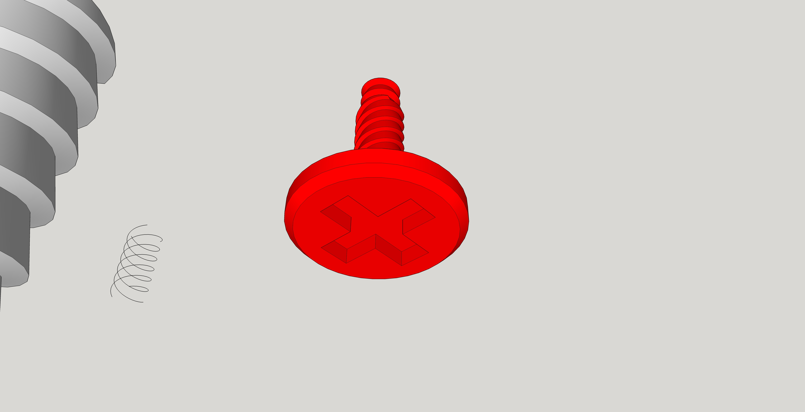
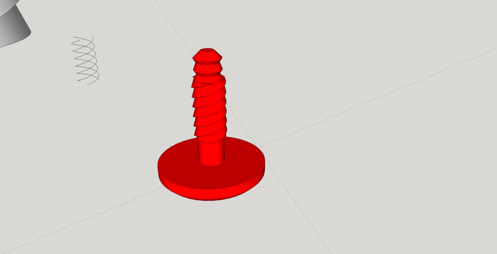
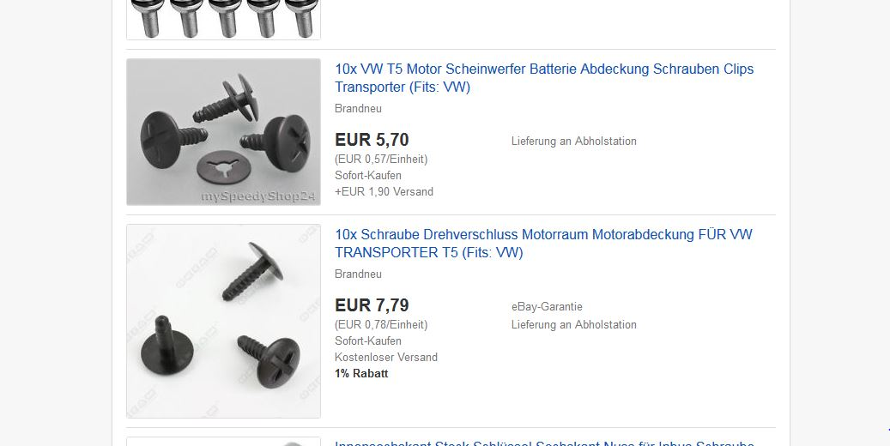

# VW-T5-Schraube
Ein Ersatzteil (Schraube) für einen VW-Bus T5 um die Motorabdeckung zu fixieren. Ein Projekt im Rahmen von 
[3d-reparatur](https://3d-reparatur.de/)

Das Ersatzteil wurde mit **SketchUp** gestaltet und im [erfindergarden](http://www.erfindergarden.de "erfindergarden") auf einem Craftbot mit einer 0,2 mm Düse und einer Schichtdicke von 0,1 mm  mit PLA gedruckt.

Die Konstruktion war nicht ganz einfach, da es sich nicht um ein metrisches Gewinde sondern ein dreifaches Gewinde mit einer asymetrischen Windungsform handelt. Konstruktionsdauer ca. 2 Stunden eine ähnliche Schraube könnte ich nun aber in ca. 1/2 Stunde konstruieren.

Die Schwachstelle ist sicherlich die Verbindung vom Kopf der Schraube zum Gewinde. Gerade in der Z-Achse ist das 3D-Druckverfahren sehr anfällig. Allerdings muss die Schraube die Motorabdeckung nur fixieren und nicht richtig festziehen.

Falls die Schraube bricht kann sie auch wieder leicht ausgebohrt werden.

